# Azure Communication Services (ACS) Real-Time Audio Agent Architecture

## Table of Contents
1. [Overview](#overview)
2. [Production Deployment Architecture](#production-deployment-architecture)
3. [Private Networking for Production (Recommended)](#private-networking-for-production-recommended)
4. [Logical Architecture Overview](#logical-architecture-overview)
5. [LLM Orchestration System](#llm-orchestration-system)
6. [Component Mapping & Integration](#component-mapping-integration)
7. [Event-Driven Architecture & Data Flow](#event-driven-architecture-data-flow)
8. [State Management & Data Persistence](#state-management-data-persistence)
9. [Key Architectural Advantages](#key-architectural-advantages)

## Overview

This document provides a comprehensive architectural overview of the Azure Communication Services (ACS) Real-Time Audio Agent system, designed for enterprise-scale voice AI applications. The architecture supports modular, industry-specific AI agents with real-time voice processing capabilities.

### **Architecture Perspectives:**
- **Production Deployment**: Enterprise Azure infrastructure with scalability, security, and reliability
- **Logical Components**: Application-layer architecture focusing on modular agent design
- **Event-Driven Flow**: Real-time data processing and state management patterns
- **Integration Patterns**: How production infrastructure maps to logical components

The system enables plug-and-play AI agents for various industries (insurance, healthcare, legal, support) while maintaining a unified communication interface through Azure Communication Services.

## Production Deployment Architecture


The production deployment architecture illustrates the enterprise-ready Azure infrastructure hosting our real-time audio agent system. This deployment emphasizes **scalability**, **reliability**, and **security** across multiple Azure services.

> **📚 Microsoft Learn Resources:**
> - [Azure Communication Services Overview](https://learn.microsoft.com/en-us/azure/communication-services/overview) - Core communication platform features
> - [Audio Streaming Overview](https://learn.microsoft.com/en-us/azure/communication-services/concepts/call-automation/audio-streaming-concept) - Bidirectional audio streaming capabilities 
> - [Media Access Overview](https://learn.microsoft.com/en-us/azure/communication-services/concepts/voice-video-calling/media-access) - Real-time media stream processing

> **⚠️ Simplified Deployment Note**: The main Terraform deployment in `infra/terraform/` uses **public endpoints** for simplified setup and faster customer onboarding. The private networking components shown in this architecture diagram are **excluded** from the main deployment but are **strongly recommended** for production scenarios. See [Private Networking for Production](#private-networking-for-production-recommended) below.

### Key Infrastructure Components

#### 🔀 **Flexible Ingress Layer** *(Not included in main deployment)*
- **App Gateway (WAF)**: SSL termination, backend health probing, and Web Application Firewall protection
- **Azure Front Door**: Optional global entry point for geo-failover and CDN capabilities
- **Load Balancing**: Intelligent traffic distribution across healthy backend instances

> **📚 Microsoft Learn Resources:**
> - [Azure Application Gateway Features](https://learn.microsoft.com/en-us/azure/application-gateway/features) - Layer 7 load balancing and SSL termination
> - [What is Azure Web Application Firewall?](https://learn.microsoft.com/en-us/azure/web-application-firewall/ag/ag-overview) - Protection against common web vulnerabilities

#### 🔐 **Secured API Exposure** *(Not included in main deployment)*
- **Azure API Management (Internal)**: Centralized API gateway behind App Gateway
- **WAF Protection**: Advanced threat protection and traffic filtering
- **Private VNet Integration**: Secured internal network connectivity

#### 🧠 **Modular Agent Platform** *(Included in main deployment)*
- **ARTAgent Orchestrator**: Supports multiple IVR engines and swappable LLM chains
- **Dynamic Routing**: Redis-based session metadata for intelligent agent selection
- **Multi-Agent Framework**: Industry-specific agents with standardized interfaces

> **📚 Microsoft Learn Resources:**
> - [What is Azure OpenAI?](https://learn.microsoft.com/en-us/azure/ai-foundry/openai/overview) - GPT models and language AI capabilities
> - [Azure OpenAI GPT-4o and GPT-4 Models](https://learn.microsoft.com/en-us/azure/ai-foundry/openai/concepts/models) - Latest model capabilities and deployment options

#### ⚙️ **Flexible Compute Options** *(Included in main deployment)*
- **Primary**: Azure Container Apps with auto-scaling capabilities
- **Alternative**: Azure Functions, AKS, or VMs for specific SLA requirements
- **Microservices**: Each agent runs as an independent, scalable service

> **📚 Microsoft Learn Resources:**
> - [Azure Container Apps Overview](https://learn.microsoft.com/en-us/azure/container-apps/overview) - Serverless containerized applications
> - [Set Scaling Rules in Azure Container Apps](https://learn.microsoft.com/en-us/azure/container-apps/scale-app) - KEDA-based auto-scaling configuration

#### 🧭 **Private Connectivity** *(Not included in main deployment)*
- **Private Endpoints**: All Azure services (Redis, Cosmos DB, OpenAI) use private networking
- **Private DNS Zones**: Linked across hub/spoke VNet topology
- **Network Security**: End-to-end private connectivity with no public internet exposure

#### 🛡️ **Security & Compliance** *(Partially included in main deployment)*
- **Security Layers**: Prompt shields, LLM safety checks, and API firewalls
- **Monitoring**: Microsoft Defender, Azure Sentinel for threat detection *(not included)*
- **Message Sanitization**: Input validation and content filtering

#### 🧬 **Reliability & Health Monitoring** *(Partially included in main deployment)*
- **Azure Service Health**: Multi-region availability monitoring *(not included)*
- **Health Probes**: Application Gateway backend health checks *(not included)*
- **Failover Support**: Active/passive fallback for RTAgents and Speech services *(not included)*

---

## Private Networking for Production (Recommended)

While the main Terraform deployment (`infra/terraform/`) uses public endpoints for simplified setup, **production deployments should implement private networking** for enhanced security, compliance, and performance. The following components are available in the Bicep deployment (`infra/bicep/`) and should be considered for production scenarios:

### 🌐 **Virtual Network Infrastructure**

#### **Hub-Spoke Network Topology**
```
📋 Available in: infra/bicep/network.bicep
🎯 Purpose: Centralized network management with isolated workload subnets

├── Hub VNet (10.0.0.0/16)
│   ├── Gateway Subnet (10.0.1.0/24)
│   ├── Azure Firewall Subnet (10.0.2.0/24)  
│   └── Bastion Subnet (10.0.3.0/24)
│
└── Spoke VNet (10.1.0.0/16)
    ├── Container Apps Subnet (10.1.1.0/24)
    ├── Private Endpoint Subnet (10.1.2.0/24)
    ├── App Gateway Subnet (10.1.3.0/24)
    └── API Management Subnet (10.1.4.0/24)
```

#### **Network Security Groups (NSGs)**
- **Granular traffic control** with subnet-level security rules
- **Application-aware filtering** for Container Apps and API services
- **Diagnostic logging** integrated with Log Analytics
- **Zero-trust network policies** with default-deny rules

### 🔐 **Private Endpoints & DNS**

#### **Azure Service Private Connectivity**
```bash
# Services with Private Endpoint support in Bicep:
✅ Azure OpenAI Service      → privatelink.openai.azure.com
✅ Azure Speech Services     → privatelink.cognitiveservices.azure.com  
✅ Azure Cosmos DB           → privatelink.mongo.cosmos.azure.com
✅ Azure Cache for Redis     → privatelink.redis.cache.windows.net
✅ Azure Storage Account     → privatelink.blob.core.windows.net
✅ Azure Key Vault           → privatelink.vaultcore.azure.net
✅ Container Apps Environment → privatelink.*.azurecontainerapps.io
✅ API Management            → privatelink.azure-api.net
```

#### **Private DNS Zone Management**
- **Automatic DNS resolution** for private endpoints
- **Cross-VNet DNS forwarding** for hybrid connectivity
- **Conditional forwarding** for on-premises integration
- **DNS zone linking** across hub-spoke topology

### 🔀 **Application Gateway & Load Balancing**

#### **Web Application Firewall (WAF)**
```
📋 Available in: infra/bicep/appgw.bicep
🎯 Features:

├── SSL/TLS Termination
│   ├── Certificate management via Key Vault
│   ├── TLS 1.2+ enforcement
│   └── HTTPS redirects
│
├── Web Application Firewall
│   ├── OWASP Core Rule Set 3.2+
│   ├── Custom security rules
│   ├── Rate limiting & DDoS protection
│   └── Geo-filtering capabilities
│
└── Backend Health Monitoring
    ├── Container Apps health probes
    ├── Automatic failover
    └── Session affinity support
```

#### **Traffic Distribution**
- **Intelligent routing** based on URL paths and headers
- **Backend pool management** with health-based routing
- **Auto-scaling integration** with Container Apps
- **SSL bridging** for end-to-end encryption

### 🛡️ **API Management & Security**

#### **Internal API Gateway**
```
📋 Available in: infra/bicep/main.bicep (API Management module)
🎯 Security Features:

├── API Gateway Functions
│   ├── Centralized API management
│   ├── Request/response transformation
│   ├── Rate limiting & throttling
│   └── API versioning & lifecycle management
│
├── Authentication & Authorization
│   ├── OAuth 2.0 / OpenID Connect
│   ├── API key management
│   ├── JWT token validation
│   └── Azure AD integration
│
└── Monitoring & Analytics
    ├── Request/response logging
    ├── Performance metrics
    ├── API usage analytics
    └── Alert configuration
```

### 🔧 **Implementation Guidance**

#### **Migration from Public to Private**

1. **Phase 1: Network Foundation**
   ```bash
   # Deploy VNet infrastructure
   az deployment group create \
     --template-file infra/bicep/network.bicep \
     --parameters vnetAddressPrefix="10.1.0.0/16"
   ```

2. **Phase 2: Private Endpoints**
   ```bash
   # Enable private endpoints for existing services
   az deployment group create \
     --template-file infra/bicep/main.bicep \
     --parameters networkIsolation=true
   ```

3. **Phase 3: Application Gateway**
   ```bash
   # Deploy WAF and load balancing
   az deployment group create \
     --template-file infra/bicep/appgw.bicep \
     --parameters enableWaf=true
   ```

#### **Configuration Requirements**

| Component | Configuration | Impact on Deployment |
|-----------|---------------|----------------------|
| **Private Endpoints** | All Azure services | +15-20 min deployment time |
| **VNet Integration** | Container Apps | Requires subnet delegation |
| **Application Gateway** | SSL certificates | Requires certificate management |
| **Private DNS** | Conditional forwarding | May require on-premises DNS changes |
| **NSG Rules** | Service-specific | Requires network security planning |

#### **Performance & Cost Considerations**

**Benefits:**

- 🚀 **Reduced latency** through private network paths
- 🔒 **Enhanced security** with no public internet exposure
- 📊 **Better compliance** with data residency requirements
- 🛡️ **DDoS protection** via Application Gateway

**Additional Costs:**

- 💰 **Application Gateway**: ~$200-500/month depending on tier
- 💰 **Private Endpoints**: ~$7.20/month per endpoint
- 💰 **VNet Integration**: Container Apps premium features
- 💰 **NAT Gateway**: ~$45/month + data processing charges

### 🎯 **Production Deployment Recommendation**

**For production workloads**, we recommend:

1. **Start with public deployment** (current Terraform) for development and testing
2. **Migrate to private networking** (Bicep deployment) for production
3. **Implement monitoring and alerting** across both public and private scenarios
4. **Plan for hybrid connectivity** if on-premises integration is required

**Quick Start for Private Networking:**
```bash
# Deploy with private networking enabled
cd infra/bicep
az deployment group create \
  --resource-group rg-rtaudioagent-prod \
  --template-file main.bicep \
  --parameters main.parameters.json \
  --parameters networkIsolation=true \
  --parameters enableAPIManagement=true
```

---

## Logical Architecture Overview

The logical architecture abstracts the underlying Azure infrastructure to focus on application components, data flow, and business logic. This view emphasizes the **modular agent design** and **real-time processing capabilities**.

### Core Architecture Diagram

```mermaid
flowchart TD
    %% ─────────────────────────── User Interface Layer ─────────────────────────────
    subgraph "👥 User Interface Layer"
        Phone["📞 Phone Calls<br/>Inbound / Outbound"]
        WebMobile["📱💻 Web & Mobile Apps<br/>Voice Interface"]
    end

    %% ─────────────────────────── Communication Bridge ─────────────────────────────
    subgraph "⚡ Azure Communication Bridge"
        ACS["🔗 Azure Communication Services<br/>Voice & Media Transport"]
        Speech["🗣️ Azure Speech Services<br/>STT ↔ TTS Processing"]
    end

    %% ─────────────────────────── AI Processing Engine ─────────────────────────────
    subgraph "🧠 Real-Time Processing"
        WebSocket["⚡ Transcription Stream<br/>via WebSocket"]
        Orchestrator["🎯 Intent Orchestrator<br/>Agent Routing + Registration"]
    end

    %% ─────────────────────────── Core Agent Framework ─────────────────────────────
    subgraph "🏗️ Modular Agent Network"
        subgraph "🔌 Core Agent Framework"
            AgentRegistry["📋 Agent Registry<br/>Component Health + Hot Swap"]
            AgentInterface["🧩 Standardized Agent Interface<br/>Common API Contract"]
        end
    end

    %% ─────────────────────────── Agent Intelligence Hub ───────────────────────────
    subgraph "🧠 Agent Intelligence Hub"
        AIHub["🧠 Agent Hub<br/>Central Control Layer"]

        %% ── Subgraph: Model-Agnostic Reasoning
        subgraph "🔄 Model-Agnostic Routing"
            TaskRouter{🎯 Model Router}
            TaskRouter -->|Complex Reasoning| O1["🔬 o1-preview<br/>Advanced Analytics"]
            TaskRouter -->|Speed Critical| GPT4o["⚡ GPT-4o<br/>Real-Time Output"]
            TaskRouter -->|Cost Sensitive| GPT4oMini["💰 GPT-4o-mini<br/>Standard Tasks"]
        end

        %% ── Subgraph: Industry-Specific Agents
        subgraph "🏥 Industry-Specific Agents"
            FNOL["📋 FNOL Agent"]
            Healthcare["🏥 Healthcare Agent"]
            Legal["⚖️ Legal Agent"]
            Support["🛠️ Support Agent"]
            NAgents["💬 Custom Agents"]
        end

        %% ── Subgraph: Memory Store
        subgraph "🧠 Memory Store"
            ShortTermMemory["📊 Short-Term Memory<br/>Real-Time Session"]
            LongTermMemory["🗃️ Long-Term Memory<br/>Historical Context"]
        end

        %% ── Subgraph: Tool Store
        subgraph "🧰 Tool Store"
            FetchData["📄 Fetch Data<br/>from Docs or APIs"]
            SyncAction["🔁 Sync Action<br/>External Services"]
            CustomFunction["💻 Custom Function<br/>Python Logic"]
        end
    end

%% ─────────────────────────── Session Management ─────────────────────────────
subgraph "📦 Session Management"
    Queue["📥 Agent-Agnostic Queue"]
    Redis["💾 Redis State<br/>Live Context"]
    Manager["🧠 Conversation Manager<br/>Dynamic Agent Assignment"]
end

%% ─────────────────────────── Flow Connections ─────────────────────────────
    Phone <--> ACS
    WebMobile <--> ACS
    ACS --> Speech
    Speech --> WebSocket
    WebSocket --> Orchestrator

    Orchestrator --> AgentRegistry
    AgentRegistry --> AgentInterface
    AgentInterface --> AIHub

    AIHub --> FNOL
    AIHub --> Healthcare
    AIHub --> Legal
    AIHub --> Support
    AIHub --> NAgents
    AIHub --> TaskRouter

    TaskRouter --> Queue
    Queue --> Speech

    Orchestrator --> Manager
    Manager --> Redis
    ShortTermMemory --> Redis

    %% Tools & Memory Used by Custom Agents
    NAgents --> ShortTermMemory
    NAgents --> LongTermMemory
    NAgents --> FetchData
    NAgents --> SyncAction
    NAgents --> CustomFunction

    %% ─────────────────────────── Styles ─────────────────────────────
    classDef user fill:#4CAF50,stroke:#2E7D32,stroke-width:3px,color:#FFFFFF
    classDef bridge fill:#2196F3,stroke:#1565C0,stroke-width:3px,color:#FFFFFF
    classDef process fill:#FF9800,stroke:#E65100,stroke-width:3px,color:#FFFFFF
    classDef agent fill:#9C27B0,stroke:#6A1B9A,stroke-width:3px,color:#FFFFFF
    classDef infra fill:#F44336,stroke:#C62828,stroke-width:3px,color:#FFFFFF

    class Phone,WebMobile user
    class ACS,Speech bridge
    class WebSocket,Orchestrator process
    class FNOL,Healthcare,Legal,Support,NAgents,AIHub,O1,GPT4o,GPT4oMini,TaskRouter agent
    class Queue,Redis,Manager infra
```



---

## LLM Orchestration System

The Real-Time Voice Agent implements a sophisticated **dual-orchestration architecture** providing two distinct conversation pathways optimized for different use cases and control requirements.

### Orchestration Approaches

| **Traditional Multi-Agent** | **Voice Live API** |
|---------------------------|-------------------|
| Full control over agent routing | Azure AI Agent Service orchestration |  
| Pluggable agent handlers | Configuration-driven agents |
| Local LLM calls with custom tools | Direct API streaming |
| Higher latency, full customization | Lower latency, simplified integration |
| MEDIA/TRANSCRIPTION modes | VOICE_LIVE mode |

### Architecture Selection


**For detailed orchestration architecture, agent routing patterns, and implementation details, see:**
👉 **[LLM Orchestration Documentation](llm-orchestration.md)**

---

## Component Mapping & Integration

This section maps the production Azure infrastructure to the logical application components, showing how the enterprise deployment supports the modular agent architecture.

### Infrastructure-to-Logic Mapping

| **Production Component** | **Logical Component** | **Integration Pattern** | **Scalability Model** |
|-------------------------|----------------------|------------------------|----------------------|
| **Azure App Gateway + WAF** | User Interface Layer | HTTP/HTTPS ingress, SSL termination | Horizontal scaling with health probes |
| **Azure Communication Services** | Communication Bridge | WebRTC, PSTN integration | Auto-scaling based on concurrent calls |
| **Container Apps (ARTAgent)** | Agent Network | Microservices with REST APIs | KEDA-based auto-scaling |
| **Azure OpenAI Service** | AI Model Hub | HTTP API with managed identity | Request-based throttling and quotas |
| **Azure Redis Cache** | Session Management | In-memory state with TTL | Cluster mode with read replicas |
| **Azure Cosmos DB** | Persistent Storage | NoSQL with global distribution | Provisioned or serverless throughput |
| **Azure Speech Services** | STT/TTS Processing | REST API with streaming | Concurrent request scaling |
| **Event Grid** | Event Processing | Pub/sub with guaranteed delivery | Topic-based fan-out scaling |

### Integration Patterns

#### **🔄 State Synchronization**
- **Redis**: Real-time session state shared across all agent instances
- **Cosmos DB**: Persistent conversation history and user profiles
- **Event Grid**: Asynchronous state change notifications

#### **🎯 Dynamic Agent Routing**
- **Agent Registry**: Container Apps self-register with health endpoints
- **Load Balancer**: App Gateway routes based on agent availability
- **Session Affinity**: Redis maintains agent-to-session mapping

#### **🔐 Security Integration**
- **Managed Identity**: All Azure services use credential-less authentication
- **Private Endpoints**: No public internet exposure for backend services
- **API Management**: Centralized authentication and rate limiting

---

## Event-Driven Architecture & Data Flow

The system operates on an event-driven architecture that enables real-time processing and seamless integration with external systems.

### Real-Time Event Processing Flow

This section details how events flow through the application's event-driven architecture, from initial triggers to final processing outcomes.

```mermaid
graph TB
    %% ═══════════════════════════════════════════════════════════════════════════════
    %% Event Sources & Triggers
    %% ═══════════════════════════════════════════════════════════════════════════════
    subgraph Sources["🔥 Event Sources"]
        InboundCall["📞 Inbound Call<br/>Event Grid → /answer"]
        AudioChunk["🎵 Audio Chunk<br/>ACS Media → WebSocket"]
        STTResult["🗣️ STT Result<br/>Speech SDK → Callback"]
        UserMessage["💬 User Message<br/>Browser → /conversation"]
        SystemEvent["⚙️ System Event<br/>Health/Status Changes"]
    end

    %% ═══════════════════════════════════════════════════════════════════════════════
    %% Event Processing Pipeline
    %% ═══════════════════════════════════════════════════════════════════════════════
    subgraph Pipeline["⚡ Event Processing Pipeline"]
        direction TB
        
        subgraph Validation["🛡️ Event Validation"]
            AuthCheck["🔐 Authentication<br/>JWT/Entra ID"]
            SchemaVal["📋 Schema Validation<br/>Event Structure"]
            RateLimit["🚦 Rate Limiting<br/>Per-session throttling"]
        end

        subgraph Routing["🎯 Event Routing"]
            EventBus["📡 Event Bus<br/>FastAPI Event System"]
            HandlerSelect["🔄 Handler Selection<br/>StreamMode-based routing"]
            LoadBalance["⚖️ Load Balancing<br/>Pool resource allocation"]
        end

        subgraph Processing["🧠 Event Processing"]
            direction LR
            MediaHandler["🎥 Media Handler<br/>3-thread architecture"]
            ConversationHandler["💭 Conversation Handler<br/>Browser-based processing"]
            SystemHandler["⚙️ System Handler<br/>Health & monitoring"]
        end
    end

    %% ═══════════════════════════════════════════════════════════════════════════════
    %% Real-Time Processing Threads
    %% ═══════════════════════════════════════════════════════════════════════════════
    subgraph Threads["🧵 Real-Time Processing Threads"]
        direction TB
        
        subgraph SpeechThread["🎤 Speech SDK Thread"]
            AudioBuffer["🔊 Audio Buffer<br/>Continuous processing"]
            PartialSTT["⚡ Partial Results<br/>< 10ms barge-in detection"]
            FinalSTT["✅ Final Results<br/>Complete utterances"]
        end

        subgraph RouteThread["🔄 Route Turn Thread"]
            SpeechQueue["📥 Speech Queue<br/>Serialized processing"]
            AgentOrchestrator["🤖 Agent Orchestrator<br/>Context + intent routing"]
            TTSGeneration["🗣️ TTS Generation<br/>Response synthesis"]
        end

        subgraph MainThread["🌐 Main Event Loop"]
            WSManager["🔌 WebSocket Manager<br/>Connection lifecycle"]
            TaskCoordinator["⚡ Task Coordinator<br/>Cancellation & cleanup"]
            StateSync["🔄 State Synchronization<br/>Redis updates"]
        end
    end

    %% ═══════════════════════════════════════════════════════════════════════════════
    %% State Management & Persistence
    %% ═══════════════════════════════════════════════════════════════════════════════
    subgraph State["🏗️ State Management"]
        direction LR
        
        subgraph Memory["💾 In-Memory State"]
            ActiveSessions["🔄 Active Sessions<br/>WebSocket connections"]
            AudioStreams["🎵 Audio Streams<br/>Processing buffers"]
            TaskRegistry["📋 Task Registry<br/>Background operations"]
        end

        subgraph Persistent["🗄️ Persistent State"]
            RedisCache["⚡ Redis Cache<br/>Session data & context"]
            CosmosDB["📚 Cosmos DB<br/>Conversation history"]
            BlobStorage["📦 Blob Storage<br/>Audio recordings"]
        end
    end

    %% ═══════════════════════════════════════════════════════════════════════════════
    %% Response & Output Events
    %% ═══════════════════════════════════════════════════════════════════════════════
    subgraph Outputs["📤 Output Events"]
        direction TB
        
        AudioResponse["🔊 Audio Response<br/>TTS → ACS/Browser"]
        TranscriptUpdate["📝 Transcript Update<br/>Dashboard broadcast"]
        StatusNotification["📢 Status Notification<br/>Connection/session state"]
        ErrorAlert["🚨 Error Alert<br/>Monitoring & logging"]
        MetricsEvent["📊 Metrics Event<br/>Performance tracking"]
    end

    %% ═══════════════════════════════════════════════════════════════════════════════
    %% Flow Connections
    %% ═══════════════════════════════════════════════════════════════════════════════
    
    %% Source to Pipeline
    InboundCall --> Validation
    AudioChunk --> Validation
    STTResult --> Validation
    UserMessage --> Validation
    SystemEvent --> Validation

    %% Pipeline Flow
    Validation --> Routing
    Routing --> Processing

    %% Processing to Threads
    MediaHandler --> SpeechThread
    MediaHandler --> RouteThread
    MediaHandler --> MainThread
    ConversationHandler --> MainThread
    SystemHandler --> MainThread

    %% Thread Coordination
    PartialSTT -.->|"Barge-in trigger"| TaskCoordinator
    FinalSTT --> SpeechQueue
    TTSGeneration --> AudioResponse
    AgentOrchestrator --> RedisCache
    WSManager --> TranscriptUpdate

    %% State Updates
    ActiveSessions <--> RedisCache
    SpeechQueue --> CosmosDB
    AudioStreams --> BlobStorage
    TaskRegistry --> MetricsEvent

    %% Output Generation
    AudioResponse --> AudioChunk
    TranscriptUpdate --> StatusNotification
    TaskCoordinator --> ErrorAlert

    %% Styling
    classDef source fill:#E8F5E8,stroke:#4CAF50,stroke-width:2px
    classDef pipeline fill:#E3F2FD,stroke:#2196F3,stroke-width:2px
    classDef thread fill:#FFF3E0,stroke:#FF9800,stroke-width:2px
    classDef state fill:#F3E5F5,stroke:#9C27B0,stroke-width:2px
    classDef output fill:#FFEBEE,stroke:#F44336,stroke-width:2px

    class InboundCall,AudioChunk,STTResult,UserMessage,SystemEvent source
    class Validation,Routing,Processing,EventBus,HandlerSelect,LoadBalance pipeline
    class SpeechThread,RouteThread,MainThread,AudioBuffer,PartialSTT,FinalSTT thread
    class Memory,Persistent,ActiveSessions,RedisCache,CosmosDB state
    class AudioResponse,TranscriptUpdate,StatusNotification,ErrorAlert,MetricsEvent output
```



#### Event Processing Characteristics

**⚡ Real-Time Processing:**
- **Sub-10ms**: Partial STT results trigger immediate barge-in detection
- **Sub-50ms**: Task cancellation and audio playback stops
- **Background**: AI processing and TTS generation occur asynchronously

**🔄 Event Coordination:**
- **Thread-Safe Queues**: Cross-thread communication via `asyncio.Queue`
- **Event Loop Integration**: `run_coroutine_threadsafe` for main loop coordination
- **Resource Pooling**: Shared STT/TTS clients across concurrent sessions

**📊 State Synchronization:**
- **Memory → Redis**: Session state persistence with TTL expiration
- **Redis → Cosmos**: Long-term conversation history archival
- **Audio → Blob**: Recording storage for compliance and analysis

### Key Event Types

| **Event Type** | **Trigger** | **Payload** | **Subscribers** |
|---------------|-------------|-------------|-----------------|
| `CALL_STARTED` | ACS call connection | Session ID, caller info | Analytics, logging, resource allocation |
| `PARTICIPANT_JOINED` | New participant | Participant details | Authentication, notifications |
| `TRANSCRIPTION_RECEIVED` | STT completion | Text, confidence, timestamp | AI processing, storage |
| `AGENT_RESPONSE_GENERATED` | AI completion | Response text, agent type | TTS, analytics |
| `RECORDING_STARTED` | Call recording begins | Recording ID, metadata | Compliance, storage |
| `ERROR_OCCURRED` | System errors | Error details, context | Alerting, diagnostics |
| `CALL_ENDED` | Call termination | Duration, outcome | Billing, analytics, cleanup |

---

## State Management & Data Persistence

The architecture implements a multi-tiered data strategy optimized for real-time performance and long-term persistence.

### Data Storage Strategy

| **Data Type** | **Storage** | **Shared** | **Persistence** | **Use Case** | **TTL/Retention** |
|---------------|:-----------:|:----------:|:---------------:|--------------|:------------------:|
| **Session Metadata** | 🗄️ Cosmos DB | ✅ Yes | 📅 Long-term | Call history, compliance | 7 years |
| **Active Session State** | 🔄 Redis | ✅ Yes | ⏱️ Short-term | Real-time conversation | 24 hours |
| **Transcription History** | 🗄️ Cosmos DB | ✅ Yes | 📅 Long-term | Audit, training data | 7 years |
| **Live Transcription** | 🔄 Redis | ✅ Yes | ⏱️ Real-time | Active conversation | 1 hour |
| **Agent Performance** | 🗄️ Cosmos DB | ✅ Yes | 📅 Long-term | Analytics, optimization | 2 years |
| **User Profiles** | 🗄️ Cosmos DB | ✅ Yes | 📅 Long-term | Personalization | Indefinite |
| **WebSocket Connections** | 💾 In-Memory | ❌ No | ⚡ Process-bound | Real-time communication | Process lifetime |
| **Audio Streams** | 💾 In-Memory | ❌ No | ⚡ Process-bound | STT processing | Stream duration |
| **Conversation Context** | 🔄 Redis | ✅ Yes | ⏱️ Short-term | AI grounding | Session + 1 hour |

> **📚 Microsoft Learn Resources:**
> - [Azure Cosmos DB Use Cases](https://learn.microsoft.com/en-us/azure/cosmos-db/use-cases) - NoSQL database for modern applications 
> - [Global Data Distribution](https://learn.microsoft.com/en-us/azure/cosmos-db/distribute-data-globally) - Multi-region data replication and consistency
> - [Azure Cosmos DB for NoSQL](https://learn.microsoft.com/en-us/azure/cosmos-db/nosql/overview) - JSON document storage with SQL-like queries

### Cross-Worker State Management

```mermaid
graph LR
    subgraph "Worker A Process"
        WA_Memory["🧠 In-Memory<br/>• WebSocket<br/>• Audio Stream<br/>• AsyncIO Tasks"]
        WA_Redis["🔄 Redis Access<br/>• Session State<br/>• Conversation History<br/>• Agent Assignment"]
    end
    
    subgraph "Worker B Process"
        WB_Memory["🧠 In-Memory<br/>• WebSocket<br/>• Audio Stream<br/>• AsyncIO Tasks"]
        WB_Redis["🔄 Redis Access<br/>• Session State<br/>• Conversation History<br/>• Agent Assignment"]
    end
    
    subgraph "Shared State Layer"
        Redis["💾 Redis Cluster<br/>• Cross-worker coordination<br/>• Session persistence<br/>• Real-time updates"]
        Cosmos["🗄️ Cosmos DB<br/>• Long-term storage<br/>• Analytics<br/>• Compliance"]
    end

    WA_Redis <--> Redis
    WB_Redis <--> Redis
    Redis --> Cosmos
    
    classDef worker fill:#e3f2fd,stroke:#1976d2,stroke-width:2px
    classDef shared fill:#f3e5f5,stroke:#7b1fa2,stroke-width:2px
    
    class WA_Memory,WB_Memory,WA_Redis,WB_Redis worker
    class Redis,Cosmos shared
```



### Key Design Principles

#### **🔄 Eventual Consistency**
- Redis provides immediate consistency for active sessions
- Cosmos DB ensures eventual consistency for historical data
- Event Grid guarantees at-least-once delivery for state changes

#### **⚡ Performance Optimization**
- Hot data (active sessions) stored in Redis for sub-millisecond access
- Cold data (historical records) stored in Cosmos DB with query optimization
- In-memory objects for process-bound, real-time operations

#### **🛡️ Fault Tolerance**
- Redis cluster with read replicas for high availability
- Cosmos DB multi-region distribution with automatic failover
- Graceful degradation when shared state is temporarily unavailable

---

## Key Architectural Advantages

### 🔌 **Enterprise-Grade Modularity**

#### **Plug-and-Play Agent Ecosystem**
- **🏗️ Standardized Interface**: Common API contract ensures seamless agent integration
- **📋 Dynamic Discovery**: Agents self-register with capability metadata for automatic routing
- **🔄 Hot-Swapping**: Deploy new agents without system downtime or session interruption
- **⚙️ Configuration-Driven**: Add industry-specific agents through YAML configuration changes

#### **Channel-Agnostic Communication**
- **🔌 Unified Hub**: ACS abstracts communication protocols (voice, SMS, Teams, WhatsApp)
- **📡 Event-Driven**: New channels integrate through existing event processing pipeline
- **🌐 Protocol Independence**: Voice, text, and video flow through standardized interfaces

### ⚡ **Zero-Friction Scalability**

#### **Azure-Native Auto-Scaling**
- **🏗️ Container Apps**: Built-in KEDA scaling based on HTTP requests and queue depth
- **⚖️ Intelligent Load Balancing**: Application Gateway with health probes and session affinity
- **📈 Predictive Scaling**: Azure Monitor integration for pattern-based resource allocation

#### **Microservices Excellence**
- **🔄 Service Mesh Ready**: Istio support for advanced traffic management and observability
- **🚀 Zero-Downtime Deployments**: Blue-green deployments with Container Apps revisions
- **🔐 Workload Identity**: Managed identities for credential-less Azure service access
- **📊 Distributed Telemetry**: End-to-end tracing with Application Insights

### 🚀 **Future-Proof Design**

#### **Technology-Agnostic Foundation**
- **🧠 Model Router**: Intelligent routing across GPT, Claude, Gemini based on performance and cost
- **🔌 Cloud-Agnostic**: Vendor-neutral design supporting hybrid and multi-cloud deployments
- **📈 Unlimited Extensibility**: Support for unlimited agent types with specialized knowledge domains

> **Note**: Model routing capability uses simple YAML configurations mapping agents/tasks to specific models. Advanced routing features are planned for future implementation.

#### **Adaptive Intelligence**
- **🎯 Context-Aware Routing**: Automatic agent selection based on detected intent and user context
- **📊 Performance Optimization**: Continuous optimization based on success rates and satisfaction metrics
- **🔄 Machine Learning Integration**: Agent performance data feeds back into routing algorithms

---

This architecture documentation provides a comprehensive view from enterprise deployment to detailed implementation, enabling both infrastructure teams and developers to understand how the production Azure environment supports the modular, real-time AI agent system.
