# LLM Orchestration Architecture

The Real-Time Voice Agent provides three orchestration modes: **Traditional Multi-Agent** (MEDIA/TRANSCRIPTION) and **Voice Live API Integration** (VOICE_LIVE), each optimized for different use cases.

## Architecture Overview


## Mode Comparison

| Mode | Audio | STT | Orchestration | Latency | Use Case |
|------|-------|-----|---------------|---------|----------|
| **TRANSCRIPTION** | 16kHz | Azure Speech | Local multi-agent | Medium | Pre-transcribed analysis |
| **MEDIA** | 16kHz | Local SDK | Local multi-agent | High | Full pipeline control |
| **VOICE_LIVE** | 24kHz | Azure OpenAI | Cloud-managed | Low | Real-time conversations |

## Audio Processing

### Audio Requirements by Mode

| Mode | Sample Rate | Channels | Processing | Quality |
|------|-------------|----------|------------|---------|
| **TRANSCRIPTION/MEDIA** | 16kHz PCM | Mono | [ACS Standard](https://learn.microsoft.com/en-us/azure/communication-services/concepts/call-automation/audio-streaming-concept) | Telephony |
| **VOICE_LIVE** | 24kHz PCM | Mono | [Azure OpenAI Native](https://learn.microsoft.com/en-us/azure/ai-foundry/openai/how-to/realtime-audio-websockets) | Premium |

### Key Differences

- **Traditional modes**: Require 16kHz resampling for ACS compatibility
- **Voice Live**: Native 24kHz processing, no resampling overhead
- **Latency impact**: Voice Live's higher sample rate + no resampling = lower overall latency

## Data Flow Patterns

```mermaid
sequenceDiagram
    participant C as Client
    participant H as Handler
    participant P as Processing
    participant O as Output
    
    Note over C,O: TRANSCRIPTION Mode
    C->>H: Audio Stream
    H->>P: Azure Speech STT
    P->>O: Multi-Agent → TTS
    O-->>C: Audio Response
    
    Note over C,O: MEDIA Mode  
    C->>H: Audio Stream
    H->>P: Local STT → Multi-Agent
    P->>O: Local TTS
    O-->>C: Audio Response
    
    Note over C,O: VOICE_LIVE Mode
    C->>H: Audio Stream
    H->>P: Direct AI Foundry (Voice Live)
    P-->>C: Audio Response (Direct)
```



## Traditional Multi-Agent Orchestration

### Core Components

#### 1. Dependency Injection
FastAPI provides orchestrator function to endpoints via `get_orchestrator()` dependency.

#### 2. Orchestration Flow
```python
async def route_turn(cm, transcript, ws, *, is_acs: bool):
    # 1. Authentication check
    # 2. Agent registry lookup
    # 3. Execute specialized agent
    # 4. Handle escalation
```

#### 3. Agent Registry
Dynamic agent lookup system:
- **AutoAuth**: Authentication handling
- **General**: General conversation
- **Claims**: Domain-specific processing

#### 4. Agent Implementation
Each agent follows the pattern:
1. Load YAML configuration
2. Build voice-optimized prompts  
3. Execute LLM with tools
4. Process function calls
5. Generate TTS response
6. Update conversation memory

## Voice Live API Integration

### Core Features

The Voice Live mode bypasses local orchestration entirely, streaming directly to [Azure OpenAI Realtime API](https://learn.microsoft.com/en-us/azure/ai-foundry/openai/how-to/realtime-audio-websockets).

#### Voice Live Handler
```python
class VoiceLiveHandler:
    async def handle_audio_data(self, audio_base64: str):
        # Direct passthrough - no local processing
        await self.realtime_client.send_audio(audio_base64)
```

#### Supported Models
- `gpt-4o-realtime-preview` (2024-12-17)
- `gpt-4o-mini-realtime-preview` (2024-12-17)  
- `gpt-realtime` (2025-08-28)

#### Key Benefits
- **No local orchestration**: All processing in Azure
- **Sub-50ms latency**: "Speech in, speech out" processing
- **24kHz native**: Premium audio quality

## Processing Pipeline Comparison

### Traditional Multi-Agent Flow
```
Audio → STT → Local Orchestrator → Agent → LLM → Tools → TTS → Audio
```

### Voice Live API Flow  
```
Audio → Azure OpenAI Realtime API → Audio
```

**Key Trade-off**: Traditional provides granular control, Voice Live provides end-to-end optimization.

## Configuration

### Mode Selection
```bash
# Traditional Multi-Agent
export ACS_STREAMING_MODE=MEDIA
export ACS_STREAMING_MODE=TRANSCRIPTION

# Voice Live API
export ACS_STREAMING_MODE=VOICE_LIVE
export VOICE_LIVE_AGENT_YAML="path/to/agent.yaml"
```

### Handler Factory
The system automatically selects the appropriate handler based on `ACS_STREAMING_MODE`:

- **MEDIA/TRANSCRIPTION**: Creates `ACSMediaHandler` with orchestrator
- **VOICE_LIVE**: Creates `VoiceLiveHandler` with direct API connection

### Resource Management
- **Traditional**: Uses STT/TTS/LLM pools with local orchestration
- **Voice Live**: Uses agent pools with Azure-managed orchestration

## Summary

This architecture provides flexibility between **full local control** (Traditional Multi-Agent) and **simplified integration** (Voice Live API), allowing developers to choose the appropriate complexity level for their use cases.

### When to Use Each Mode

| Use Case | Recommended Mode | Reason |
|----------|------------------|---------|
| Custom business logic | MEDIA/TRANSCRIPTION | Full orchestration control |
| Rapid prototyping | VOICE_LIVE | Simplified implementation |
| Low-latency conversations | VOICE_LIVE | Sub-50ms response times |
| Complex tool integration | MEDIA/TRANSCRIPTION | Custom function calling |

> **📖 References**: [Azure Communication Services](https://learn.microsoft.com/en-us/azure/communication-services/concepts/call-automation/audio-streaming-concept) • [Azure OpenAI Realtime API](https://learn.microsoft.com/en-us/azure/ai-foundry/openai/how-to/realtime-audio-websockets) • [Azure Speech Services](https://learn.microsoft.com/en-us/azure/ai-services/speech-service/speech-to-text)